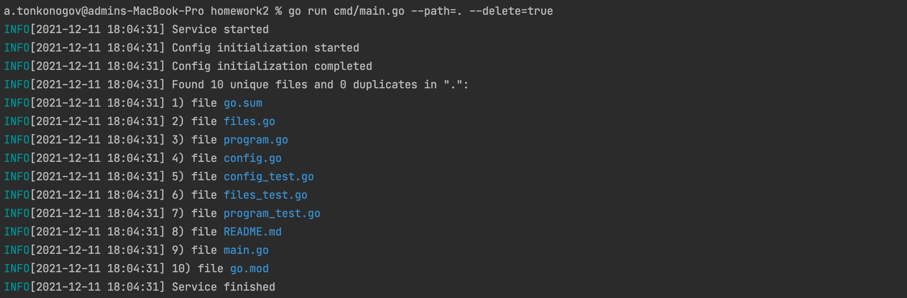
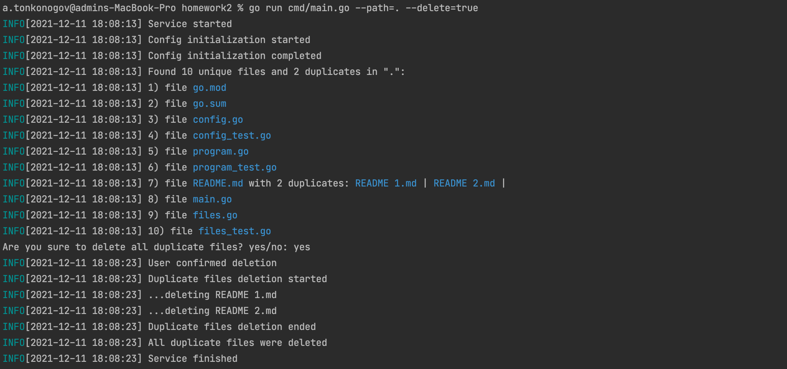
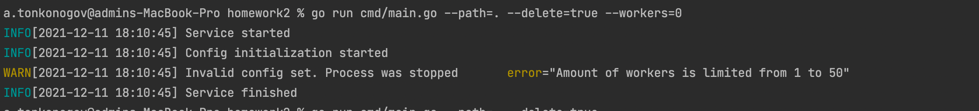
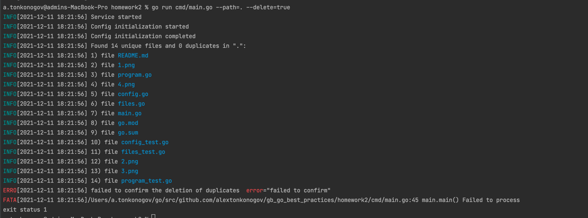
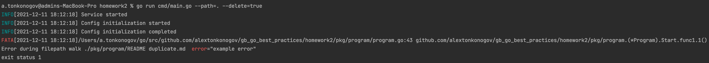

# gb-go-best-practices

Для запуска открыть директорию homework2 в консоли и выполнить команду.

```shell
go run cmd/main.go --path=. --delete=true
```

Если дубликаты не найдены, то программа завершится с таким выводом:



Если дубликаты найдутся, то программа спросит, можно ли их удалить



В случае ошибок пользователя или других незначительных ошибках мы увидим ворнинги



В случае критичных ошибок будет Error



К заданию:

_Вставить вызов panic() в участке коде, в котором осуществляется переход в поддиректорию;
удостовериться, что по логам можно локализовать при каком именно переходе в какую директорию сработала паника_



см [здесь](./pkg/program/program.go) 39 и 40 строки
